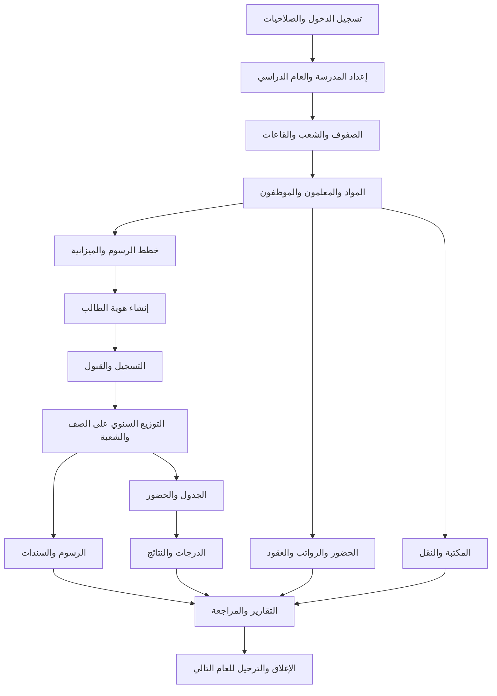

# دليل سيناريو التشغيل الكامل لنظام SchoolSystem

## 1. الغرض ونطاق الدليل

يشرح هذا الدليل دورة العمل الكاملة في **SchoolSystem** كما يجب أن ينفذها موظفو المدرسة والإدارة والحسابات، بدءاً من إعداد النظام والمستخدمين، مروراً بالطلاب والمعلمين والمواد والفصول والحضور والدرجات والمكتبة والنقل والرواتب، وانتهاءً بالرسوم والسندات والمصروفات والتقارير والإغلاق السنوي.

> القاعدة التشغيلية المركزية: لا تُنشئ بيانات تابعة قبل إنشاء البيانات الأساسية التي تعتمد عليها، ولا تنتقل إلى الرسوم قبل اكتمال التسجيل والقبول والتوزيع، ولا تعدّل سجلاً مالياً مسدداً دون إجراء تسوية موثق.

هذا الملف **سيناريو اختبار وتشغيل عملي** وليس مجرد وصف للواجهات. يجب تنفيذ خطواته على قاعدة اختبار، مع تسجيل أرقام السجلات الناتجة بعد كل عملية.

## 2. خريطة دورة العمل

## 3. قاعدة الاختبار والبيانات المرجعية

استخدم قاعدة اختبار منفصلة، ولا تستخدم بيانات حقيقية أو أرقام هويات حقيقية. أنشئ نسخة احتياطية قبل بدء السيناريو، واحتفظ بسجل يوضح المستخدم المنفذ والتاريخ ورقم كل عملية.

| العنصر | بيانات الاختبار المقترحة |
|---|---|
| العام الحالي | 2026/2027 |
| العام السابق | 2025/2026 |
| الصفوف | الأول الإعدادي، الثاني الإعدادي، الأول الثانوي، الثاني الثانوي |
| الشعب | A، B، C |
| القاعات | قاعة 101، قاعة 102، مختبر الحاسوب |
| أنواع الرسوم | رسوم تسجيل، رسوم دراسية، كتب، زي مدرسي، مواصلات، أنشطة |
| عملة الاختبار | العملة المحلية المعتمدة في المدرسة |
| كلمة مرور الاختبار | تُنشأ من شاشة المستخدمين ولا تُكتب في هذا الملف |

## 4. المرحلة الأولى: الدخول والصلاحيات والإعدادات

### 4.1 تسجيل الدخول

افتح شاشة **تسجيل الدخول** وأدخل حساب مدير النظام التجريبي. تحقق من رفض كلمة المرور الخاطئة برسالة عربية واضحة، ومن عدم ظهور كلمة المرور نصاً. بعد الدخول يجب أن تظهر الواجهات المسموح بها فقط وفق الصلاحيات المحفوظة في قاعدة البيانات.

### 4.2 المستخدمون والأدوار

من واجهة **المستخدمين** أنشئ الحسابات التالية، ثم اختبر تسجيل الخروج وإعادة الدخول لكل حساب.

| الحساب | الدور التشغيلي | الواجهات الأساسية |
|---|---|---|
| مدير النظام | إدارة كاملة | جميع الواجهات والإعدادات |
| موظف التسجيل | إدخال الطلاب والقبول والتوزيع | الطلاب، التسجيل، التوزيع، التقارير ذات الصلة |
| المحاسب | التحصيل والمصروفات والرواتب | الرسوم، الخطط، السندات، المصروفات، الرواتب |
| معلم | الحضور والدرجات والجدول | المواد، الجدول، الحضور، الدرجات |
| أمين المكتبة | الكتب والإعارة | المكتبة والتقارير الخاصة بها |
| مراقب | عرض وتقارير فقط | لوحة التحكم والتقارير المسموح بها |

امنح مستخدم موظف التسجيل صلاحية عرض وإضافة وتعديل الطلاب والتسجيل والتوزيع، ثم سجل دخوله وتأكد من أنه لا يستطيع فتح المصروفات أو إدارة المستخدمين. ألغِ صلاحية التوزيع، وسجل الدخول مرة أخرى، وتأكد من اختفاء الواجهة أو رفض العملية برسالة واضحة. يجب ألا تعتمد الواجهة على الشكل فقط؛ يجب أن يرفض الخادم أو الخدمة العملية أيضاً.

> مدير النظام حساب محمي: لا يُحذف ولا تُعدّل صلاحياته من الواجهة. أي تغيير استثنائي يجب أن يتم بإجراء إداري مباشر وموثق في قاعدة البيانات.

### 4.3 الإعدادات والنسخ الاحتياطي

من **الإعدادات** أدخل اسم المدرسة والعنوان والهاتف وشعار المدرسة إن كان مدعوماً. راجع تنسيق التاريخ والعملة. نفّذ نسخة احتياطية اختبارية، وتحقق من حفظ ملف النسخة في المسار المحدد، ثم سجّل عملية النسخ في سجل التدقيق.

## 5. المرحلة الثانية: الصفوف والشعب والقاعات

### 5.1 الفصول الدراسية

افتح **إدارة الفصول** واضغط **جديد**. أدخل اسم الصف، واترك رقم الفصل وكوده للتوليد التلقائي. احفظ، ثم حاول إنشاء الصف نفسه مرة ثانية. يجب أن يمنع النظام التكرار أو يعرض رسالة تفيد بوجوده.

### 5.2 الشعب

من شاشة إدارة الشعب أو الشاشة المرتبطة بالفصول أنشئ `A` و`B` و`C` للصف الأول الثانوي للعام `2026/2027`. أدخل السعة والنوع أو الجنس المسموح إذا كانت الحقول متاحة. لا تقبل الشعبة دون صف وعام.

### 5.3 القاعات

افتح **القاعات**، وأنشئ قاعة 101 وقاعة 102 ومختبر الحاسوب. اترك رقم القاعة والكود للتوليد التلقائي إن كانا مدعومين، وتأكد من ظهور الاسم في القائمة المنسدلة. اختبر منع إنشاء قاعتين بالاسم أو الكود نفسه.

### 5.4 التحقق

تحقق من ظهور الصف والشعبة والقاعة في القوائم المنسدلة في التسجيل والتوزيع والجدول. إذا ظهرت قائمة فارغة، لا تتابع الإدخال؛ أصلح البيانات المرجعية أولاً.

## 6. المرحلة الثالثة: المواد والمعلمون والموظفون

### 6.1 المعلمون

من **إدارة المعلمين** أضف المعلمين الآتين: محمد عبدالله، سعاد علي، خالد حسن. أدخل التخصص والهاتف والبريد إن كانت الحقول موجودة. يجب أن يرفض النظام الأرقام في الاسم، وأن يرفض رقم هاتف غير صالح أو بريد إلكتروني غير صحيح عند تطبيق التحقق.

اختبر تعديل بيانات معلم، ثم عطّل معلماً. يجب ألا يظهر المعلم غير النشط في قوائم التعيين الجديدة، مع بقاء سجلاته التاريخية في التقارير.

### 6.2 الموظفون والعقود

من واجهة الموظفين أو العقود، أنشئ موظف الحسابات أحمد سالم وموظفة شؤون الطلاب منى علي. أدخل نوع العقد وتاريخ البداية والراتب الأساسي، ثم احفظ العقد. جرّب تاريخ نهاية سابقاً لتاريخ البداية؛ يجب أن يرفض النظام العملية.

### 6.3 المواد

من **إدارة المواد** أضف المواد: اللغة العربية، الرياضيات، العلوم، اللغة الإنجليزية، الحاسوب. اربط كل مادة بالصف المناسب إن كانت الواجهة تسمح بذلك. يجب منع تكرار المادة بالرمز نفسه، ويجب ألا يقبل النظام مادة بلا اسم أو رمز عند كونهما مطلوبين.

## 7. المرحلة الرابعة: خطة الرسوم والمحاسبة الأساسية

### 7.1 إنشاء خطط الرسوم

من **خطط الرسوم** أنشئ خطط العام `2026/2027` للصف الأول الثانوي كما يلي:

| نوع الرسم | المبلغ | الاستحقاق | إلزامي |
|---|---:|---|---|
| رسوم تسجيل | 10000 | 2026-09-15 | نعم |
| رسوم دراسية | 120000 | 2026-09-30 | نعم |
| رسوم كتب | 15000 | 2026-10-05 | نعم |
| رسوم زي مدرسي | 25000 | 2026-10-15 | لا |
| رسوم أنشطة | 5000 | 2026-11-01 | لا |

أنشئ خطة مختلفة للصف الثاني الثانوي، ولا تنسخ مبلغ الصف الأول دون مراجعة. يجب أن تمنع الشاشة خطة مكررة لنفس العام والصف ونوع الرسم، وأن تحدث البنود غير المسددة عند تعديل الخطة وفق سياسة النظام.

### 7.2 قاعدة الربط المحاسبي

يرتبط الرسم بالطالب والعام والتوزيع الفعلي وخطة الصف. لا يعتمد تحديد الرسوم على `Students.ClassID` وحده؛ لأن الطالب قد يكون في صف مختلف في العام التالي. يجب أن يبقى كل عام مالياً مستقلاً.

## 8. المرحلة الخامسة: إدخال الطلاب والتسجيل والقبول والتوزيع

### 8.1 طالب جديد

من **إدارة الطلاب** أضف أحمد محمد علي حسن، برقم وطني تجريبي `1000000001`، والجنس ذكر، وتاريخ الميلاد `2010-05-12`، والهاتف `777100001`. اترك رقم الطالب للتوليد التلقائي. ابحث عنه بالاسم والرقم الوطني وتأكد من وجود هوية واحدة.

من **التسجيل والقبول** أنشئ طلباً للعام `2026/2027`، ونوعه طالب جديد، والصف الأول الثانوي، والحالة جديد. احفظ، ثم عدّل الحالة إلى مقبول. لا تُنشئ الرسوم أو التوزيع قبل ظهور الحالة مقبول فعلياً.

من **توزيع الطلاب** اختر العام والصف والشعبة A، ثم وزع أحمد. يجب أن تمنع إعادة التوزيع في العام نفسه، وأن تظهر رسالة عربية إذا لم يكن التسجيل مقبولاً أو كانت الشعبة ممتلئة.

### 8.2 طالب منقول

أضف سارة خالد حسن بالرقم الوطني التجريبي `1000000002`. في التسجيل اختر النوع منقولاً وأدخل المدرسة السابقة والوثائق المطلوبة إن كانت الحقول متاحة. اتركها جديداً للمراجعة، ثم اقبل الطلب ووزعها في الشعبة B.

### 8.3 طالب موجود في عام جديد

لا تنشئ هوية جديدة لأحمد. أنشئ له تسجيلاً في العام `2027/2028` بنوع طالب موجود أو ترفيع حسب سياسة المدرسة، ثم اقبله ووزعه في الصف الثاني الثانوي. يجب أن تبقى رسوم العام السابق وسنداته منفصلة.

### 8.4 طالب معيد

استخدم طالباً موجوداً وأنشئ له تسجيلاً من نوع إعادة قيد في الصف نفسه للعام الجديد. بعد القبول والتوزيع، يجب أن ترتبط رسومه بخطة العام الجديد، ولا يجوز نقل السداد القديم تلقائياً.

### 8.5 طلب مرفوض

أنشئ طلباً ثالثاً واجعله مرفوضاً. حاول توزيعه وتوليد رسومه. يجب رفض العمليتين، مع بقاء الطلب محفوظاً للتدقيق وعدم حذفه تلقائياً.

## 9. المرحلة السادسة: الرسوم والسداد والسندات

بعد توزيع أحمد في الصف الأول الثانوي والشعبة A، افتح **الرسوم** واختر الطالب والعام ونوع الرسم. عند اختيار رسوم دراسية يجب أن يظهر `120000` تلقائياً من خطة الصف. عند اختيار رسوم تسجيل يجب أن يظهر `10000`. إذا لم توجد خطة، تظهر رسالة تمنع الحفظ وتطلب إنشاء الخطة.

ولّد رسوم الطالب من الخطة. أعد الضغط مرة ثانية؛ يجب ألا تُنشأ سجلات مكررة. اختر رسوم الدراسة وسجل دفعة `50000`. يجب أن يصبح المدفوع `50000` والمتبقي `70000` والحالة مسدد جزئياً. سجل الدفعة الثانية `70000`، ثم تحقق من تحوّل الحالة إلى مسدد.

افتح **السندات** وتحقق من وجود سند قبض فريد لكل دفعة، مرتبط بالطالب والرسم ومرجع الدفع. حاول إنشاء السند نفسه مرة أخرى أو إعادة تشغيل عملية الدفع؛ يجب أن تمنع الحماية السند التلقائي المكرر. حاول دفع مبلغ أكبر من المتبقي؛ يجب رفضه.

> لا تحذف رسماً عليه سداد إلا عبر إجراء تسوية أو إلغاء مالي موثق، لأن حذف السجل يخفي الأثر المحاسبي.

## 10. المرحلة السابعة: المصروفات والرقابة النقدية

من **المصروفات** أضف مصروف شراء قرطاسية بمبلغ `30000`، ومصروف صيانة بمبلغ `45000`. أدخل التاريخ والجهة والوصف وطريقة الدفع. يجب رفض المبلغ السالب أو المصروف بلا تاريخ أو وصف عند كونه مطلوباً.

راجع إجمالي المصروفات اليومية والشهرية، وقارنها بالسندات. اختبر تعديل مصروف معتمد؛ إذا كانت سياسة النظام تمنع التعديل بعد الاعتماد، يجب أن تظهر رسالة ويتطلب التصحيح قيداً عكسياً أو تسوية.

من **التقارير** استخرج تقرير الإيرادات من رسوم الطلاب، وتقرير المصروفات، وصافي الحركة النقدية:

`صافي الحركة = المقبوضات - المصروفات`

لا تعتبر الرسوم غير المسددة إيراداً نقدياً؛ يجب فصل الإجمالي المستحق عن المقبوض فعلياً.

## 11. المرحلة الثامنة: الحضور والانصراف

### 11.1 حضور الطلاب

من **الحضور اليومي للطلاب** اختر العام والتاريخ والصف والشعبة. حمّل الطلاب، واجعل أحمد حاضراً وسارة غائبة مع ملاحظة. احفظ، ثم أعد فتح الشاشة وتحقق من بقاء السجلات. حاول تسجيل اليوم نفسه مرتين؛ يجب منع التكرار أو تحديث السجل بدلاً من إنشاء سجل ثانٍ.

### 11.2 حضور الموظفين

من **حضور الموظفين** اختر التاريخ وسجل حضور المعلمين والموظفين. اختبر الغياب والتأخير، ثم راجع أثر الحضور في التقارير أو الرواتب إذا كان الربط مفعلاً.

## 12. المرحلة التاسعة: الجدول الدراسي

من **الجدول الدراسي** أنشئ حصصاً للصف الأول الثانوي والشعبة A: رياضيات يوم الأحد، لغة عربية يوم الاثنين، علوم يوم الثلاثاء. اربط كل حصة بالمادة والمعلم والقاعة والوقت.

يجب رفض تعارض المعلم في الوقت نفسه، وتعارض القاعة، وتداخل حصتين للشعبة نفسها. عدّل حصة واختبر أن الجدول المطبوع يعرض الصف والشعبة والمعلم والقاعة بشكل صحيح.

## 13. المرحلة العاشرة: الدرجات والنتائج

من **إدخال الدرجات** اختر العام والصف والشعبة والمادة. أدخل لأحمد: أعمال سنة `18/20`، اختبار منتصف `25/30`، نهائي `40/50`. أدخل لسارة قيماً مختلفة، ثم احفظ.

اختبر القيم الحدية والصحيحة: صفر، الدرجة الكاملة، والكسور إن كانت مسموحة. يجب رفض درجة سالبة أو أكبر من الدرجة العظمى أو درجة بلا طالب أو مادة. أعد فتح الشاشة وتحقق من حفظ القيم، ثم استخرج كشف درجات أحمد.

إذا كان النظام يحسب النتيجة، تحقق من أن مجموع الدرجات يساوي مجموع المكونات، وأن حالة الطالب لا تتغير بسبب تعديل رسومه. يجب أن تبقى البيانات الأكاديمية والمالية منفصلتين مع الربط بالتقارير المشتركة.

## 14. المرحلة الحادية عشرة: المكتبة والإعارة

من **المكتبة** أضف كتاب الرياضيات، الرقم الدولي أو الكود `BK-001`، وعدد النسخ 10. أضف كتاب العلوم بالكود `BK-002` وعدد النسخ 5.

أعر كتاباً لأحمد، ثم أعده. تحقق من نقصان النسخ المتاحة عند الإعارة وزيادتها عند الإرجاع. حاول إعارة نسخة غير متاحة أو إعارة الكتاب نفسه لأحمد دون إرجاعه؛ يجب أن يرفض النظام العملية. استخرج تقرير الكتب المتأخرة.

## 15. المرحلة الثانية عشرة: النقل والحافلات

من **النقل** أضف حافلة برقم وكود، ثم أنشئ مساراً يضم ثلاث محطات. اربط أحمد بالمسار والحافلة، وحدد الرسوم إن كانت خدمة النقل مدفوعة. جرّب تجاوز سعة الحافلة؛ يجب رفض الإضافة أو إصدار تحذير.

عند إزالة الطالب من النقل، لا تحذف سجله التاريخي إذا كانت عليه رسوم أو دفعات؛ يجب استخدام إلغاء أو تاريخ نهاية.

## 16. المرحلة الثالثة عشرة: الرواتب والعقود

أنشئ عقداً لمحمد عبدالله براتب أساسي `150000` وبدل `20000` وخصم `5000`. أنشئ عقداً لسعاد علي براتب `140000`. شغّل مسير الرواتب للشهر التجريبي، ثم راجع الإجمالي والصافي.

يجب منع تشغيل المسير للشهر نفسه مرتين دون إجراء إعادة احتساب موثق. يجب ألا يحسب النظام راتب موظف غير نشط أو بلا عقد ساري، ويجب أن يوضح تقرير الرواتب الأساسي والبدلات والخصومات والصافي.

## 17. المرحلة الرابعة عشرة: التقارير والمراجعة

افتح **مركز التقارير** واختبر التقارير التالية لكل عام وشهر وصف وشعبة:

| التقرير | مرشح التحقق |
|---|---|
| قائمة الطلاب | عدد الطلاب وأسماؤهم وشعبهم |
| التسجيل والقبول | الحالات جديد ومقبول ومرفوض |
| توزيع الطلاب | الصف والشعبة والعام وعدم وجود تكرار |
| كشف الرسوم | الإجمالي والمدفوع والمتبقي والحالة |
| المتأخرات | الطلاب ذوو الرصيد المستحق |
| السندات | رقم السند والمرجع والمبلغ والتاريخ |
| المصروفات | الجهة والنوع والمبلغ والتاريخ |
| الحضور | الحاضر والغائب والمتأخر |
| الدرجات | درجات الطالب والمادة والنتيجة |
| المعلمون والموظفون | الحالة والعقود والحضور |
| المكتبة | المتاح والمعار والمتأخر |
| النقل | الحافلة والمسار والطلاب |
| الرواتب | الإجمالي والخصومات والصافي |

اختبر البحث بإدخال حرف واحد، ثم عدة كلمات، ثم رقم، ثم قيمة غير موجودة. يجب تحديث النتائج دون أخطاء، ويجب أن تعمل الفلاتر مع العام والصف والشعبة والحالة.

صدّر تقريراً إلى Excel وPDF إن كانت الأزرار متاحة، وتحقق من اتجاه العربية وعدم تداخل الأعمدة أو اختفاء الأزرار. لا تعتبر التصدير ناجحاً إذا كان الملف فارغاً أو فقد العناوين أو أظهر أرقاماً غير صحيحة.

## 18. المرحلة الخامسة عشرة: سجل الأنشطة والتدقيق

افتح **سجل الأنشطة** وابحث عن إنشاء أحمد وتسجيله وقبوله وتوزيعه وتوليد رسومه وسداده. يجب أن يظهر المستخدم والتاريخ ونوع العملية والكيان ورقم السجل.

جرّب مستخدم المراقبة؛ يجب أن يستطيع العرض فقط إذا مُنح ذلك، ولا يستطيع تعديل أو حذف السجلات. يجب أن تكون عمليات الحذف والتعديل المالي والأكاديمي قابلة للتتبع.

## 19. الاختبارات السلبية الإلزامية

| الاختبار | النتيجة الصحيحة |
|---|---|
| إنشاء طالب مكرر بالرقم الوطني | رفض العملية أو اقتراح استخدام السجل الموجود |
| توزيع طالب غير مقبول | رفض برسالة واضحة |
| توزيع طالب مرتين في العام نفسه | منع التكرار |
| توليد رسوم بلا توزيع | رفض العملية |
| توليد رسوم بلا خطة | رفض العملية |
| توليد الرسوم مرتين | عدم إنشاء سجلات إضافية |
| دفع أكبر من المتبقي | رفض العملية |
| إنشاء سند تلقائي مكرر | منعه بالإشارة إلى المرجع السابق |
| إدخال اسم يحتوي أرقاماً | رفضه في حقول الأسماء |
| إدخال مبلغ سالب | رفضه |
| إدخال عام غير متسلسل | رفضه |
| إدخال درجة أكبر من الدرجة العظمى | رفضها |
| تعارض حصة مع معلم أو قاعة | رفضها |
| حذف مدير النظام من الواجهة | منعه |
| إلغاء صلاحية مستخدم | اختفاء الواجهة أو رفض الإجراء بعد إعادة الدخول |

## 20. سيناريو العام الدراسي الجديد

قبل بداية العام الجديد، أكمل اعتماد النتائج والتقارير المالية للعام الحالي. خذ نسخة احتياطية، ثم أنشئ الصفوف والشعب والخطط الجديدة. لا تمسح بيانات العام السابق.

للطالب الناجح، أنشئ تسجيل العام الجديد ثم اقبله ووزعه في الصف الأعلى. للطالب المعيد، أنشئ تسجيل إعادة قيد. للطالب المنقول، أنشئ طلباً جديداً منقولاً. بعد التوزيع، ولّد الرسوم من خطط العام الجديد.

تحقق من أن اختيار العام السابق في شاشة الرسوم يعرض رسوم العام السابق، وأن اختيار العام الجديد يعرض رسوم العام الجديد. يجب ألا تتغير السندات السابقة بسبب الترفيع أو النقل.

## 21. قواعد البيانات التي يجب مراقبتها

يجب أن تبقى العلاقات المنطقية الآتية سليمة:

| الكيان | يعتمد على |
|---|---|
| التسجيل | الطالب والعام الدراسي |
| التوزيع | الطالب والتسجيل المقبول والصف والشعبة والعام |
| الرسوم | الطالب والتوزيع وخطة الرسوم والعام |
| السداد | سجل الرسوم |
| السند | السداد أو مرجع مالي واضح |
| الدرجات | الطالب والتوزيع والمادة والعام |
| الحضور | الطالب أو الموظف والتاريخ |
| الجدول | الصف والشعبة والمادة والمعلم والقاعة |
| الراتب | الموظف والعقد والشهر |
| الإعارة | الكتاب والطالب وتاريخ الإعارة |
| المصروف | الجهة والمبلغ والتاريخ والمستخدم |

لا تحذف السجل الأب إذا كانت له سجلات مالية أو أكاديمية تابعة. استخدم التعطيل أو الإلغاء أو تاريخ النهاية، بحسب سياسة النظام.

## 22. معايير قبول النظام بعد تنفيذ السيناريو

يُعد النظام جاهزاً للاختبار النهائي عندما تتحقق الشروط الآتية:

1. يمكن إنشاء الطالب مرة واحدة وربطه بعدة أعوام دون نسخ هويته.
2. لا يمكن توزيع طالب غير مقبول أو غير نشط.
3. لا يمكن توليد رسوم طالب قبل وجود قبول وتوزيع وخطة مطابقة.
4. يظهر مبلغ الخطة تلقائياً عند اختيار الطالب والعام ونوع الرسم.
5. لا تتكرر الرسوم أو السندات عند إعادة تنفيذ العملية.
6. يمنع النظام السداد فوق المتبقي ويحافظ على تاريخ الدفعات.
7. تبقى السنوات الدراسية معزولة في الرسوم والدرجات والحضور والتقارير.
8. تمنع الصلاحيات غير المسموح بها حتى لو حاول المستخدم الوصول مباشرة إلى العملية.
9. تعمل عمليات البحث والتصفية والتصدير دون فقدان البيانات العربية.
10. تسجل العمليات المهمة في سجل التدقيق، وتوجد نسخة احتياطية قابلة للاسترجاع.

## 23. سجل التنفيذ المقترح

| التاريخ | المستخدم | الواجهة | العملية | رقم السجل | النتيجة | ملاحظات |
|---|---|---|---|---|---|---|
|  |  |  |  |  | ناجح/فاشل |  |

بعد كل خطوة، املأ هذا السجل. عند ظهور خطأ، لا تتجاوزه بإدخال بيانات عشوائية؛ احتفظ برسالة الخطأ واسم الواجهة والبيانات المستخدمة ووقت حدوثه.

## 24. الترتيب المختصر للموظف اليومي

يبدأ الموظف يومه بتسجيل الدخول بحسابه، ثم يراجع العام والصفوف والشعب، ويدخل الطلاب الجدد وطلبات التسجيل، ويراجع القبول، وينفذ التوزيع، ثم يولد الرسوم ويسجل التحصيل ويطبع السندات. بعد ذلك يسجل الحضور، ويدخل الدرجات عند الحاجة، ويراجع المصروفات والحركة المالية، ويستخرج التقارير اليومية، ثم يسجل الخروج.

> التسلسل اليومي الآمن هو: **البيانات الأساسية ← الطالب ← التسجيل ← القبول ← التوزيع ← الخطة ← الرسوم ← السداد ← السند ← التقارير والتدقيق**.

## 25. الملفات ذات الصلة داخل المشروع

للمزيد من التفاصيل التنفيذية، راجع `Student_Data_Entry_Training_Scenarios_AR.md` لسيناريو الطلاب، و`Student_Lifecycle_and_Enrollment_Workflow_AR.md` لدورة القبول والتوزيع، و`Finance_Workflow_Hardening_AR.md` لدورة الرسوم والسداد، و`Reports_Complete_Guide_AR.md` للتقارير، و`SchoolSystem_ERD.md` للعلاقات وقاعدة البيانات.

## References

هذا الدليل توثيق تشغيلي مبني على واجهات وخدمات ومستودعات مشروع **SchoolSystem** الموجودة في المستودع، وعلى ملفات التوثيق الداخلية المشار إليها في القسم السابق. لا يعتمد الدليل على بيانات خارجية أو بيانات إنتاجية.
