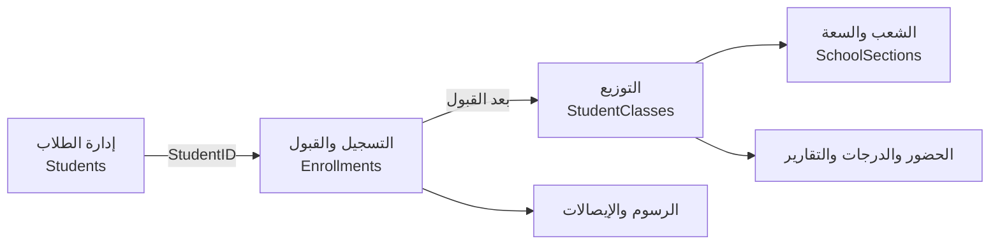

# دورة حياة الطالب والعلاقة بين إدارة الطلاب والتسجيل والقبول والتوزيع

## الخلاصة

العلاقة الصحيحة في نظام مدرسي حقيقي هي: **إدارة الطلاب تحفظ هوية الطالب الدائمة، التسجيل والقبول يحفظ طلب الطالب وقراره في عام دراسي، والتوزيع يحفظ الصف والشعبة الفعليين لذلك العام**. لا ينبغي إنشاء طالب جديد عند كل تسجيل أو إعادة أو ترفيع، ولا ينبغي اعتبار `Students.ClassID` بديلاً عن التاريخ السنوي.

> القاعدة الذهبية: طالب واحد = ملف هوية واحد، وتسجيل واحد فعال لكل عام دراسي، وتوزيع واحد فعال لكل عام دراسي.

## مسؤولية كل شاشة

| الشاشة | المسؤولية | مصدر الحقيقة |
|---|---|---|
| إدارة الطلاب | الهوية، الاسم، الرقم الوطني، الميلاد، ولي الأمر، الهاتف، الحالة العامة | `Students` |
| التسجيل والقبول | طلب الالتحاق، نوع الطلب، العام، المستندات، الرسوم، حالة الطلب، الصف المطلوب | `Enrollments` |
| توزيع الطلاب | الصف والشعبة الفعليان، السعة، رقم الجلوس، النقل الداخلي | `StudentClasses` و`SchoolSections` |
| التقارير والحضور والدرجات | قراءة الوضع الحالي والتاريخي بحسب الطالب والعام والتوزيع | السجلات السنوية المرتبطة بـ `AcademicYear` |

## العلاقة المنطقية بين الواجهات



`Students` إلى `Enrollments` علاقة `1:N` لأن الطالب قد يسجل في أعوام متعددة. و`Students` إلى `StudentClasses` علاقة `1:N` تاريخية لأن الطالب قد يملك توزيعاً في كل عام، ولكن يجب ألا يملك أكثر من توزيع فعال في العام نفسه. أما الصف فيحتوي عدة شعب، والشعبة تستقبل عدة طلاب.

في التنفيذ الحالي، العلاقة بين التوزيع والشعبة تعتمد على `ClassID + Section + AcademicYear`. وهذا يعمل مع التحقق البرمجي، لكن النموذج الأقوى هو إضافة `SchoolSectionID` إلى `StudentClasses` وربطه بمفتاح خارجي مباشر.

## التسلسل الصحيح للعمليات

### التسجيل الأول لطالب جديد

يبحث الموظف أولاً بالرقم الوطني أو رقم الطالب أو الهاتف. إذا لم توجد هوية مطابقة، ينشئ الطالب مرة واحدة في `Students` بعد التحقق من عدم تكرار الرقم الوطني. بعد ذلك ينشئ طلباً في `Enrollments` مرتبطاً بـ `StudentID` والعام الدراسي.

يبدأ الطلب بحالة `جديد` أو `قيد المراجعة`. لا ينشأ `StudentClasses` في هذه المرحلة. بعد اكتمال المستندات واعتماد الطلب، تتحول حالته إلى `مقبول`، ثم يوزع الطالب في الصف والشعبة. بعد نجاح التوزيع فقط يُحجز رقم الجلوس وتُحدث الحقول الحالية المختصرة في `Students`.

إذا رُفض الطلب أو أُلغي، يبقى الطلب للتاريخ ولا يوجد له توزيع فعال.

### طالب موجود يسجل في عام جديد

لا يُنشأ طالب جديد. تختار شاشة التسجيل الطالب الموجود، تتحقق من عدم وجود تسجيل فعال له في العام المطلوب، ثم تنشئ `Enrollment` جديداً بنفس `StudentID` وبعام جديد. بعد القبول ينشأ توزيع جديد في `StudentClasses` للعام الجديد. هكذا يحتفظ النظام بتاريخ السنوات السابقة.

### الطالب المنقول من مدرسة أخرى

ينشأ له ملف `Students` مرة واحدة، ويُنشأ طلب `Enrollments` بنوع `منقول`. تحفظ المدرسة السابقة والصف السابق وسبب النقل في الطلب. هذه البيانات لا تحدد الصف الحالي؛ الصف الحالي يستمد من توزيع العام الحالي.

### النقل الداخلي بين الشعب أو الصفوف

لا ينشئ النقل الداخلي طالباً أو طلب قبول جديداً لنفس العام. تتحقق الخدمة من وجود توزيع حالي، ومن أن الشعبة الهدف تابعة للصف الهدف وللعام نفسه، ومن توفر السعة، ثم تنفذ النقل.

للحفاظ على التاريخ، الأفضل إغلاق التوزيع القديم وإنشاء سجل جديد مع سبب النقل وتاريخه. أما تحديث السجل نفسه فيحافظ على الحالة الحالية لكنه يفقد تاريخ المكان السابق، ولذلك يجب على الأقل تسجيل العملية في سجل التدقيق أو إنشاء جدول `StudentClassTransfers`.

### الإعادة

الطالب المعيد موجود مسبقاً. في العام الجديد ينشأ طلب بنوع `إعادة`، وتُحفظ نتيجة أو صف العام السابق للمرجعية، ثم يوزع في الصف المعاد فيه. لا يجوز تغيير سجل العام السابق ليصبح العام الجديد، ولا إنشاء هوية جديدة.

### الترفيع

بعد اعتماد نتيجة العام السابق، ينشأ تسجيل جديد للعام التالي للطالب نفسه، ويحدد الصف التالي وفق قواعد المدرسة، ثم ينشأ توزيع جديد. يبقى تسجيل وتوزيع العام السابق دون تعديل حتى لا تتأثر التقارير التاريخية.

## حالات التسجيل وقواعد الانتقال

| الحالة | يسمح بالتوزيع؟ | القاعدة |
|---|---:|---|
| `جديد` | لا | طلب مدخل ولم يبدأ اعتماده |
| `قيد المراجعة` | لا | المستندات أو القرار غير مكتمل |
| `مقبول` | نعم | أصبح مؤهلاً للتوزيع |
| `موزع` | نعم، توزيع فعال واحد | اكتمل ربطه بصف وشعبة |
| `مرفوض` | لا | يبقى للتاريخ ولا ينشئ توزيعاً |
| `ملغي` | لا | يغلق الطلب وأي توزيع فعال مرتبط به |
| `منسحب` | لا | تحفظ واقعة الانسحاب دون حذف الطالب |
| `مكتمل` | لا | قراءة تاريخية فقط |

يجب تعريف الحالات كثوابت مركزية في الخدمة وقاعدة البيانات، وليس كسلاسل نصية مختلفة داخل كل واجهة. كما يجب تطبيع العام الدراسي إلى قيمة واحدة مثل `2026/2027` أو الأفضل إنشاء جدول `AcademicYears` واستخدام `AcademicYearID`.

## الفجوات التي يجب منعها

| الفجوة | أثرها | الحل |
|---|---|---|
| تسجيل طالب غير موجود | سجل يتيم | FK إلى `Students` والتحقق داخل معاملة |
| إنشاء طالب جديد عند الإعادة أو الترفيع | تكرار الهوية | البحث الإجباري قبل الإنشاء |
| توزيع طلب مرفوض أو جديد | طالب في فصل دون قبول | السماح بالتوزيع فقط للحالة `مقبول` |
| تسجيلان فعالان للطالب في العام نفسه | ازدواج الرسوم والتقارير | قيد فريد على الطالب والعام للحالات الفعالة |
| توزيعين للطالب في العام نفسه | حضور ودرجات مزدوجة | قيد فريد للتوزيع الفعال |
| شعبة لا تتبع الصف | توزيع غير صحيح | FK مباشر إلى `SchoolSections` أو تحقق ذري من الثلاثي |
| تعديل `Students.ClassID` يدوياً | انفصال الملف عن التاريخ | التعديل عبر خدمة التوزيع فقط |
| تحديث النقل فوق السجل السابق | فقد تاريخ النقل | سجل نقل مستقل أو سجل تدقيق إلزامي |
| حذف طلب بعد القبول | فقد المرجع الأكاديمي | منع الحذف واستخدام `ملغي` أو أرشفة |
| استخدام رقم الجلوس كرقم الطالب | تغير هوية الطالب | رقم الطالب دائم، ورقم الجلوس سنوي |
| اختلاف صيغ العام | تكرار مخفي | تطبيع العام مركزياً |
| الشعبة كنص حر | أخطاء إملائية وسعة خاطئة | استخدام `SchoolSectionID` |
| حفظ القبول والتوزيع بخطوتين منفصلتين | نصف عملية | معاملة SQL ذرية مع `COMMIT/ROLLBACK` |

## العملية الذرية لاعتماد الطلب وتوزيعه

ينبغي أن تنفذ الخدمة هذه الخطوات داخل معاملة واحدة:

```text
BEGIN TRANSACTION
  قفل طلب التسجيل والطالب للتحديث
  التحقق من وجود الطالب وكونه نشطاً
  التحقق من العام وحالة الطلب
  التحقق من عدم وجود تسجيل فعال آخر لنفس الطالب والعام
  التحقق من الصف والشعبة والسعة
  التحقق من عدم وجود توزيع فعال آخر
  إنشاء StudentClasses
  تحديث حالة Enrollment إلى موزع
  تحديث الحقول الحالية المختصرة في Students
COMMIT
```

عند فشل أي تحقق يجب تنفيذ `ROLLBACK`، بحيث لا يبقى تسجيل دون توزيع أو توزيع دون قبول. ولا ينبغي أن تعتمد سلامة النظام على ضغط المستخدم زرين بالترتيب الصحيح.

## تقييم التنفيذ الحالي

الأساس الموجود في المشروع جيد: توجد جداول منفصلة للطلاب والتسجيل والتوزيع، ويوجد ربط FK للتسجيل بالطالب والصف، وتتحقق خدمة التوزيع من وجود الطالب والصف، وتمنع التوزيع المكرر في العام، كما أن النقل ينفذ داخل معاملة ويحدث الحقول الحالية في `Students`.

أما النقاط التي يجب تثبيتها نهائياً فهي: ربط التوزيع بحالة القبول، منع التسجيل النشط المكرر في العام نفسه، حفظ تاريخ النقل بدلاً من الكتابة فوق السجل القديم، استبدال `Section` النصي بمرجع `SchoolSectionID`، منع تعديل الحقول الأكاديمية في `Students` خارج خدمة التوزيع، وتوحيد الحالات والأعوام في طبقة الخدمة وقاعدة البيانات.

## اختبارات قبول أساسية

| الاختبار | النتيجة الصحيحة |
|---|---|
| إدخال هوية وطنية مكررة | رفض واضح قبل الحفظ |
| تسجيل طالب موجود في عام جديد | `Enrollment` جديد بنفس `StudentID` |
| تسجيل الطالب مرتين في العام | رفض التسجيل الثاني |
| توزيع طلب مرفوض | رفض العملية |
| توزيع الطالب مرتين في العام | رفض العملية |
| نقل الطالب بين شعبتين | توزيع فعال واحد، مع حفظ التاريخ عند تفعيل سجل النقل |
| إعادة الطالب | تسجيل وتوزيع جديدان للعام الجديد |
| ترفيع الطالب | تسجيل وتوزيع للعام التالي دون تعديل السابق |
| حذف طالب له تاريخ | منع الحذف أو أرشفة منضبطة |
| فشل خطوة أثناء الاعتماد | لا يبقى أي جزء من العملية |

## القرار المعتمد

التدفق النهائي هو: **إدارة الهوية ← التسجيل والقبول ← التوزيع ← الحضور والدرجات والرسوم والتقارير**. التسجيل يعتمد على وجود الطالب أو ينشئه مرة واحدة، والتوزيع يعتمد على قبول التسجيل ولا ينشئ طالباً، والإعادة والترفيع والتسجيل السنوي تنشئ سجلات سنوية جديدة مع بقاء التاريخ السابق.

## مراجع المشروع

- [مخطط ERD](SchoolSystem_ERD.md)
- [ترحيل العلاقات الإنتاجية](../Databass/Migration_CompleteFiveTableRelationships.sql)
- [ترحيل منع التكرار](../Databass/Migration_AddDuplicatePreventionConstraints.sql)
- [خدمة التسجيل](../Services/EnrollmentService.cs)
- [خدمة التوزيع](../Services/StudentClassService.cs)
- [مستودع التوزيع](../DataAccess/StudentClassRepository.cs)
- [فحص سلامة المخطط](../Databass/Verify_SchemaIntegrity.sql)

**حالة الوثيقة:** تحليل تنفيذي مبني على ملفات المشروع الحالية، وقابل للتحويل إلى تغييرات برمجية وترحيلات SQL.

## References

لا توجد مصادر خارجية مستخدمة؛ جميع الملاحظات مبنية على ملفات المشروع المذكورة أعلاه.

[SchoolSystem_ERD.md]: ./SchoolSystem_ERD.md
[Migration_CompleteFiveTableRelationships.sql]: ../Databass/Migration_CompleteFiveTableRelationships.sql
[Migration_AddDuplicatePreventionConstraints.sql]: ../Databass/Migration_AddDuplicatePreventionConstraints.sql
[EnrollmentService.cs]: ../Services/EnrollmentService.cs
[StudentClassService.cs]: ../Services/StudentClassService.cs
[StudentClassRepository.cs]: ../DataAccess/StudentClassRepository.cs
[Verify_SchemaIntegrity.sql]: ../Databass/Verify_SchemaIntegrity.sql

**المؤلف:** Manus AI

## References

لا توجد مصادر خارجية مستخدمة؛ جميع الملاحظات مبنية على ملفات المشروع المذكورة أعلاه.

[SchoolSystem_ERD.md]: ./SchoolSystem_ERD.md
[Migration_CompleteFiveTableRelationships.sql]: ../Databass/Migration_CompleteFiveTableRelationships.sql
[Migration_AddDuplicatePreventionConstraints.sql]: ../Databass/Migration_AddDuplicatePreventionConstraints.sql
[EnrollmentService.cs]: ../Services/EnrollmentService.cs
[StudentClassService.cs]: ../Services/StudentClassService.cs
[StudentClassRepository.cs]: ../DataAccess/StudentClassRepository.cs
[Verify_SchemaIntegrity.sql]: ../Databass/Verify_SchemaIntegrity.sql

---

[SchoolSystem_ERD.md]: ./SchoolSystem_ERD.md
[Migration_CompleteFiveTableRelationships.sql]: ../Databass/Migration_CompleteFiveTableRelationships.sql
[Migration_AddDuplicatePreventionConstraints.sql]: ../Databass/Migration_AddDuplicatePreventionConstraints.sql
[EnrollmentService.cs]: ../Services/EnrollmentService.cs
[StudentClassService.cs]: ../Services/StudentClassService.cs
[StudentClassRepository.cs]: ../DataAccess/StudentClassRepository.cs
[Verify_SchemaIntegrity.sql]: ../Databass/Verify_SchemaIntegrity.sql

## References

لا توجد مصادر خارجية مستخدمة؛ جميع الملاحظات مبنية على ملفات المشروع الحالية المذكورة أعلاه.
